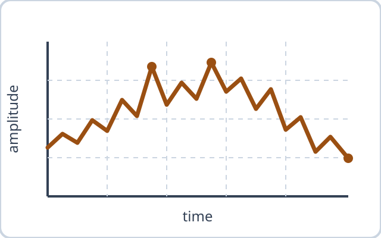
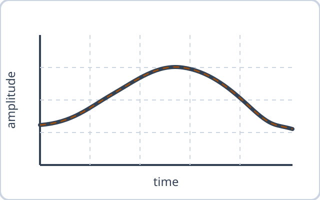
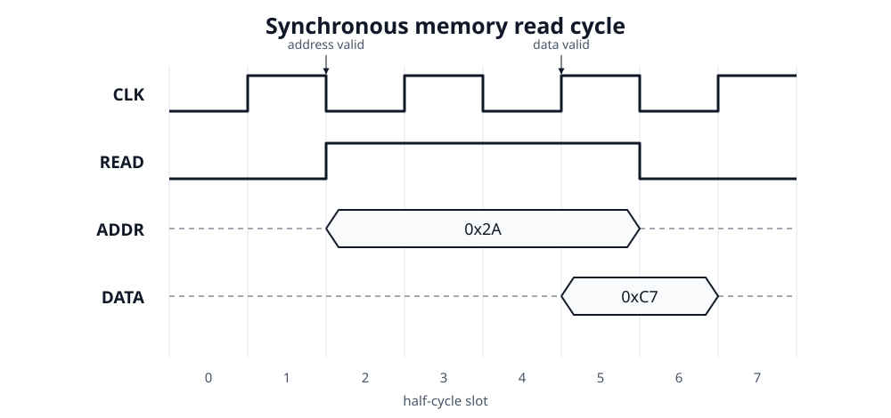
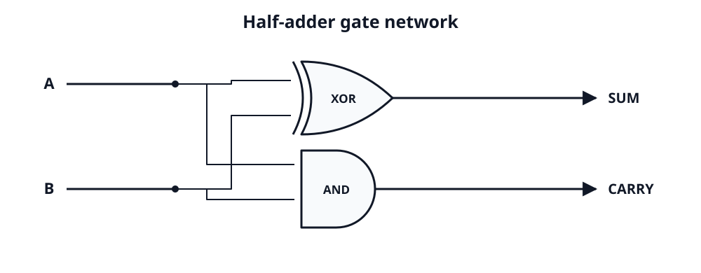
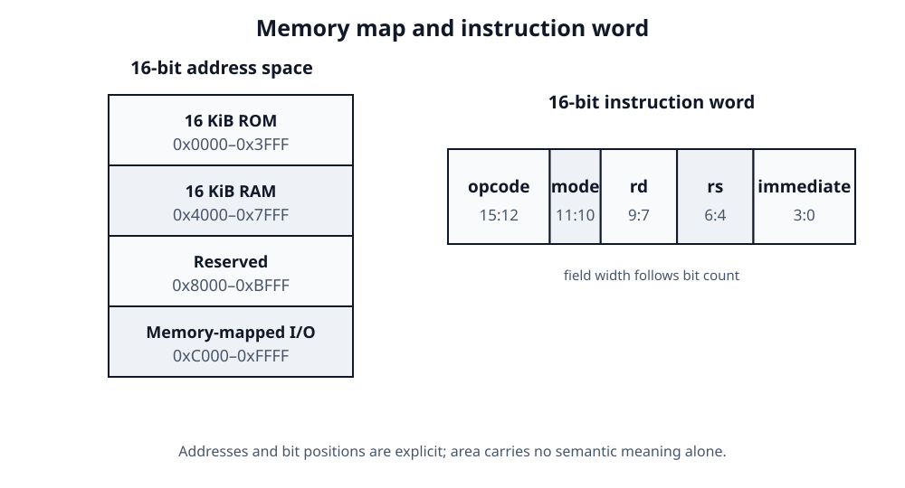
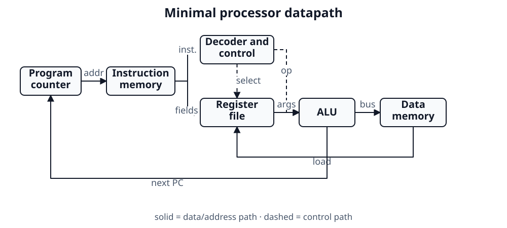
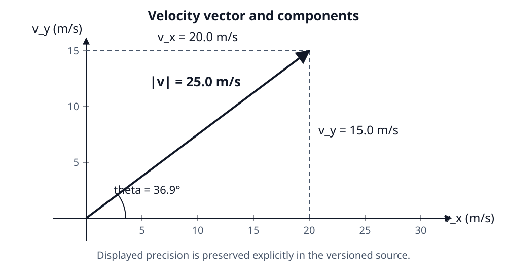
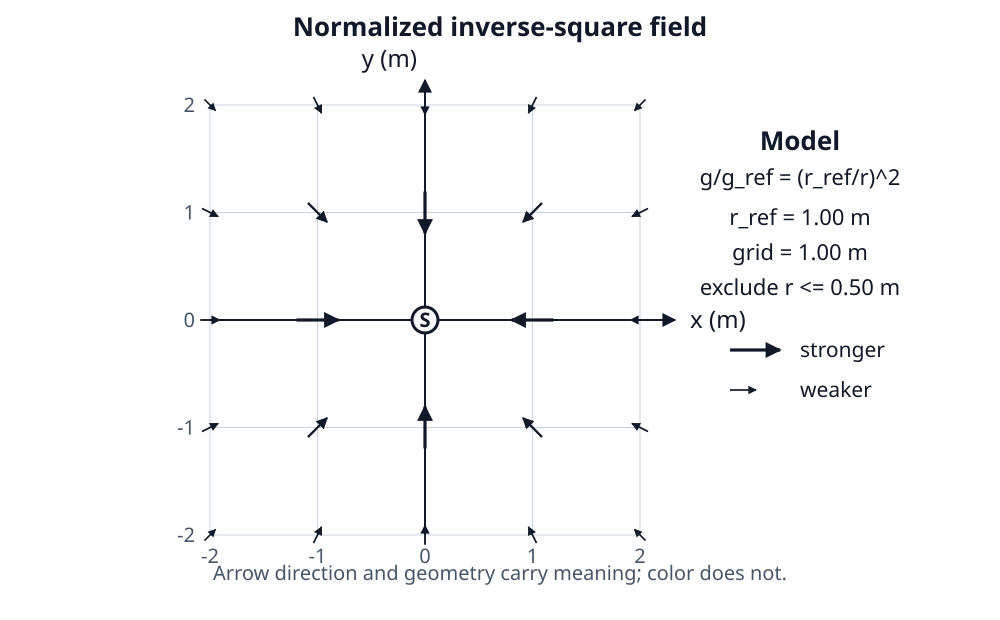

# Figures and visual evidence {#sec-figure-system}

This chapter defines the shared contract for authored images, technical art,
figure panels, output variants, and source credit. A figure must communicate
through its caption, labels, geometry, and alternative description; color may
reinforce those channels but cannot replace them.

## Captions, alternatives, and provenance {#sec-figure-anatomy}

A figure identifier names the idea rather than its filename or eventual
number. The caption tells readers why the figure matters, while `fig-alt`
describes the visual evidence needed by someone who cannot see it. Source and
license credit remain visible at the end of the caption and are also recorded
in the asset registry.

@fig-signal-chain is referenced before its definition so float movement cannot
change the meaning of the surrounding prose.

::: {#fig-signal-chain}

{fig-alt="A three-stage signal chain runs from a sensor through signal conditioning to a decision stage. Arrows label the intermediate signals as analog and normalized." width="100%"}

A labeled signal chain communicates direction and stage responsibility without
depending on color. [Source: original Alkahest fixture, CC0 1.0.]{.figure-source}
:::

## Subfigures and panel references {#sec-figure-panels}

Use a panel only when its members support one comparison. Each member receives
its own durable identifier, caption, and alternative description; the panel
adds the shared claim. In @fig-waveform-comparison, @fig-waveform-raw retains
high-frequency variation while @fig-waveform-filtered exposes the underlying
trend.

::: {#fig-waveform-comparison layout-ncol="2"}

{#fig-waveform-raw fig-alt="A jagged sampled waveform varies around a broad rise and fall, with sharp noise peaks near the middle."}

{#fig-waveform-filtered fig-alt="A smooth waveform rises to one broad peak and falls after high-frequency noise is removed."}

Raw and filtered views of the same conceptual measurement. [Source: original
Alkahest fixtures, CC0 1.0.]{.figure-source}
:::

## Full-width and output-specific art {#sec-figure-variants}

The semantic figure in @fig-system-map has one identifier, caption, reference,
and alternative description even though its presentation changes by medium.
HTML and EPUB use a restrained screen palette; PDFs use a monochrome version
whose patterns and border weights survive grayscale printing.

::: {#fig-system-map .figure-full-width}

:::: {.content-visible when-format="html"}
{fig-alt="Four modules form a closed loop: observe, model, decide, and act. Solid arrows connect the primary path, and a dashed feedback arrow returns from act to observe." width="100%"}
::::

:::: {.content-visible unless-format="html"}
{fig-alt="Four modules form a closed loop: observe, model, decide, and act. Solid arrows connect the primary path, and a dashed feedback arrow returns from act to observe." width="100%"}
::::

A closed-loop system shown as full-width art with equivalent screen and print
presentations. [Source: original Alkahest fixture, CC0 1.0.]{.figure-source}
:::

Full-width means the available page or viewport column, never the physical trim
edge. On the web the figure may extend beyond the prose measure; in EPUB it
degrades to the reader's content width; and in the one-column print profiles it
uses the live area inside the margins.

## Graph and chart generator evaluation {#sec-graph-chart-evaluation}

Four candidates use small, reviewable sources rather than feature claims.
@fig-half-adder exercises Mermaid for a simple flow. @fig-build-dependency-graph
uses Graphviz for a relationship whose layout should follow dependency edges.
@fig-response-time-chart is generated from versioned CSV by standard-library
Python and committed as SVG. A real Vega-Lite candidate specification at
`figures/data/response-time.vl.json` describes the same data but is not a
publication input until an offline static renderer and its dependency lock is
added.

```{dot}
//| label: fig-build-dependency-graph
//| fig-cap: "A validated source-to-publication dependency graph."
//| fig-alt: "Source and data both feed validation; validation feeds rendering; rendering produces HTML, EPUB, Typst PDF, and LuaLaTeX PDF outputs."
digraph build {
  graph [rankdir=LR, bgcolor="transparent", pad="0.2"];
  node [shape=box, style="rounded", fontname="sans-serif"];
  edge [color="#475569"];
  source [label="Manuscript"];
  data [label="Data and assets"];
  validate [label="Validate"];
  render [label="Render"];
  outputs [label="HTML · EPUB · Typst · LuaLaTeX"];
  source -> validate;
  data -> validate;
  validate -> render;
  render -> outputs;
}
```

[Diagram description: Manuscript source and data/assets both feed validation;
validation feeds rendering; rendering produces HTML, EPUB, Typst PDF, and
LuaLaTeX PDF outputs.]{.diagram-description}

::: {#fig-response-time-chart}

{fig-alt="A line chart with five points. Response time rises from 18 milliseconds at zero percent load to 71 milliseconds at full load, with the steepest increase above 75 percent." width="100%"}

Measured response time rises nonlinearly as the specimen system approaches
full load. [Source: generated from `figures/data/response-time.csv` by
`scripts/generate-graphs.py`; original Alkahest fixture, CC0 1.0.]{.figure-source}
:::

The current decision is deliberately plural: Mermaid is convenient for small
flows, Graphviz for dependency graphs, and committed SVG for quantitative
charts. Quarto's native diagram path is SVG or JavaScript in HTML but raster in
EPUB and PDF, so diagrams must be visually checked at the smallest trim.
The Python chart stays vector in every path and its regenerated bytes must
match the committed derivative. Vega-Lite remains deferred rather than adding
an unlocked JavaScript or browser conversion stack.

## Electrical-circuit workflow evaluation {#sec-circuit-workflow-evaluation}

The publication path uses Schemdraw 0.23 to generate one committed portable
SVG from `scripts/generate-circuits.py`. The exact Python environment is locked
by `tools/uv.lock`, and `make check-circuits` requires a fresh offline
regeneration to match the committed bytes. Equivalent evaluation-only sources
remain at `figures/candidates/voltage-divider-circuitikz.tex` and
`figures/candidates/voltage-divider-zap.typ`; neither backend-native candidate
is a publication input.

::: {#fig-voltage-divider fig-pos="H"}

{fig-alt="A nine-volt source drives a one-kiloohm upper resistor and two-kiloohm lower resistor in series. The midpoint output is six volts, the current is three milliamperes, and the lower return is grounded." width="80%"}

A nine-volt resistive voltage divider. [Source: generated by
`scripts/generate-circuits.py`; original Alkahest fixture, CC0 1.0.]{.figure-source}
:::

This single SVG keeps vector paths and selectable labels in HTML, EPUB, Typst
PDF, and LuaLaTeX PDF. Its embedded title and description supplement the
manuscript alternative text. CircuitikZ remains a strong LaTeX-only option,
while Zap remains a promising Typst-only option; selecting either would create
backend-specific source and parity work without improving this shared fixture.

## Chemistry-diagram workflow evaluation {#sec-chemistry-workflow-evaluation}

The publication path uses RDKit 2026.03.5 to generate one committed portable
SVG from `scripts/generate-chemistry.py`. Its canonical reaction SMILES is
`CC(=O)O.CCO>>CCOC(=O)C.[OH2]`. Equivalent evaluation-only sources remain at
`figures/candidates/fischer-esterification-chemfig.tex` and
`figures/candidates/fischer-esterification-typed-smiles.typ`; neither native
candidate is a publication input.

::: {#fig-fischer-esterification fig-pos="H"}

{fig-alt="Skeletal structures show acetic acid plus ethanol yielding ethyl acetate plus water, from left to right across a reaction arrow." width="100%"}

Fischer esterification of acetic acid with ethanol. [Source: generated by
`scripts/generate-chemistry.py`; original Alkahest fixture, CC0 1.0.]{.figure-source}
:::

The monochrome SVG keeps its molecular geometry and labels in HTML, EPUB,
Typst PDF, and LuaLaTeX PDF. RDKit converts glyphs to vector paths, which avoids
workstation-font drift but makes the labels nonselectable; the manuscript alt
text plus the SVG title and description are therefore part of the required
accessibility contract. Chemfig remains a mature LaTeX-only option, while
typed-smiles remains a capable Typst-only community package. Generated
structures are explanatory artwork and must still receive scientific review.

## Computing-diagram workflow {#sec-computing-diagram-workflow}

One versioned source at `figures/data/computing-diagrams.json` drives four
portable SVGs through `scripts/generate-computing-diagrams.py`. Together they
exercise the five recurring computing forms: @fig-memory-read-cycle shows a
timing diagram, @fig-half-adder-gates uses conventional logic-gate shapes,
@fig-memory-instruction-layout combines a memory map with an instruction
format, and @fig-processor-datapath shows an architecture block diagram.

::: {#fig-memory-read-cycle fig-pos="H"}

{fig-alt="Four timing lanes show a clock, an active-high read control, address 0x2A, and returned data 0xC7. The address becomes valid at slot two and the returned data at slot five." width="100%"}

A synchronous memory read cycle with explicit validity timing. [Source:
generated from `figures/data/computing-diagrams.json` by
`scripts/generate-computing-diagrams.py`; original Alkahest fixture, CC0
1.0.]{.figure-source}
:::

::: {#fig-half-adder-gates fig-pos="H"}

{fig-alt="Inputs A and B each branch to an XOR gate producing SUM and an AND gate producing CARRY." width="90%"}

A half-adder expressed as a conventional two-gate network. [Source: generated
from `figures/data/computing-diagrams.json` by
`scripts/generate-computing-diagrams.py`; original Alkahest fixture, CC0
1.0.]{.figure-source}
:::

::: {#fig-memory-instruction-layout fig-pos="H"}

{fig-alt="A sixteen-bit address space is divided into equal ROM, RAM, reserved, and memory-mapped input-output regions. Beside it, a sixteen-bit instruction contains a four-bit opcode, two-bit mode, three-bit destination, three-bit source, and four-bit immediate field." width="100%"}

Explicit address ranges and bit positions keep a memory map and instruction
format auditable. [Source: generated from
`figures/data/computing-diagrams.json` by
`scripts/generate-computing-diagrams.py`; original Alkahest fixture, CC0
1.0.]{.figure-source}
:::

::: {#fig-processor-datapath fig-pos="H"}

{fig-alt="A program counter addresses instruction memory. Instruction fields feed decoder-control and the register file; dashed control lines select registers and the ALU operation. The ALU accesses data memory, with load-data and next-program-counter feedback paths." width="100%"}

A minimal processor datapath distinguishes data and address paths from dashed
control paths without relying on color. [Source: generated from
`figures/data/computing-diagrams.json` by
`scripts/generate-computing-diagrams.py`; original Alkahest fixture, CC0
1.0.]{.figure-source}
:::

The evaluated WaveDrom 3.5.0 sources are:

- `figures/candidates/read-cycle-wavedrom.json`
- `figures/candidates/instruction-word-wavedrom.json`

WaveDrom's compact WaveJSON and register-field syntax are attractive, but
normal builds do not yet carry a pinned offline renderer. Mermaid and Graphviz
remain appropriate for automatically laid-out relationships; these bit- and
timing-sensitive fixtures instead use explicit geometry, selectable labels,
fixed view boxes, embedded descriptions, and byte-checked regeneration.

## Physics-diagram workflow {#sec-physics-diagram-workflow}

The versioned `figures/data/physics-diagrams.json` source separates numeric
values from their displayed precision, assigns every quantity a declared unit,
and records fixture provenance. `scripts/generate-physics-diagrams.py` turns it
into portable SVG without a plotting runtime. @fig-velocity-vector exercises
components, a derived magnitude, an angle, units, and three significant
figures; @fig-inverse-square-field exercises a sampled analytic field whose
direction and relative magnitude remain legible without color.

::: {#fig-velocity-vector fig-pos="H"}

{fig-alt="A velocity vector points up and right. Dashed projections label its horizontal component as 20.0 meters per second and vertical component as 15.0 meters per second. Its magnitude is 25.0 meters per second at 36.9 degrees." width="100%"}

A velocity vector with explicit components and preserved display precision.
[Source: generated from synthetic instructional data in
`figures/data/physics-diagrams.json` by
`scripts/generate-physics-diagrams.py`; original Alkahest fixture, CC0 1.0.]{.figure-source}
:::

::: {#fig-inverse-square-field fig-pos="H"}

{fig-alt="Twenty-four arrows sampled on a one-meter square grid point inward toward an excluded central source. Arrows nearer the source are longer and heavier, showing greater relative inverse-square field strength without using color." width="100%"}

A normalized inverse-square field with an explicit sampling grid, reference
radius, exclusion radius, and visual-strength legend. [Source: analytically
generated from synthetic instructional data in
`figures/data/physics-diagrams.json` by
`scripts/generate-physics-diagrams.py`; original Alkahest fixture, CC0 1.0.]{.figure-source}
:::

These are explanatory fixtures, not experimental results. Real data must name
the measurand, acquisition or calculation method, source/version, units,
uncertainty where applicable, transformations, creator, date, license, and any
limits on reuse. Significant figures must reflect the stated measurement and
uncertainty policy rather than merely the number of digits a program can print.

## Rich-media workflow {#sec-rich-media-workflow}

The `alk-media` shortcode resolves stable entries from the versioned
`media.json` registry. HTML receives a native player or sandboxed local frame;
EPUB, Typst, and LuaLaTeX receive the registered SVG fallback, accessible
description, and complete transcript. The registry locks source bytes,
fallbacks, transcripts, captions, provenance, license, and public-distribution
permission so an unsupported player never becomes missing content.

### Audio with a waveform fallback {#sec-rich-media-audio}



### Captioned video with a poster fallback {#sec-rich-media-video}



### Controllable animation with reduced motion {#sec-rich-media-animation}



### Keyboard-operable interactive demonstration {#sec-rich-media-interactive}



Media must never autoplay with sound. Time-based content needs appropriate
controls, synchronized captions where relevant, visual description, and a
descriptive transcript. Animation must offer pause/stop behavior and respect
reduced-motion preferences. Interactives must preserve native keyboard access,
visible labels and focus, programmatic state, and a text result. The static
fallback must communicate the lesson rather than merely showing a generic
play-button poster.

## Float and placement policy {#sec-figure-floats}

Author figures at the document's top level, close to their first reference.
Fixed-layout engines may move a figure to a nearby legal position to avoid a
large gap or split caption. The exact page is not part of the manuscript
contract: the stable identifier and generated reference carry the relationship.

The LuaLaTeX adapter permits here, top, bottom, or float-page placement. Typst
uses its native book-figure placement. HTML and EPUB keep figures in reading
order. Authors must not write “above,” “below,” or a page number unless an
edition-specific review artifact is deliberately being discussed.

## Authoring boundary {#sec-figure-boundary}

Prefer SVG for diagrams, plots, and line art; use a high-resolution raster only
when the subject is inherently photographic or textured. Do not encode a
caption inside an image, and do not repeat every visible label in alternative
text. Print/web variants are allowed only when they preserve the same meaning,
labels, reading order, identifier, and caption. Materially different content
requires a separate figure and reference.
