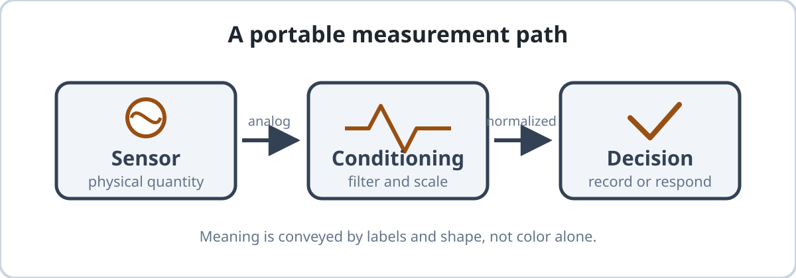
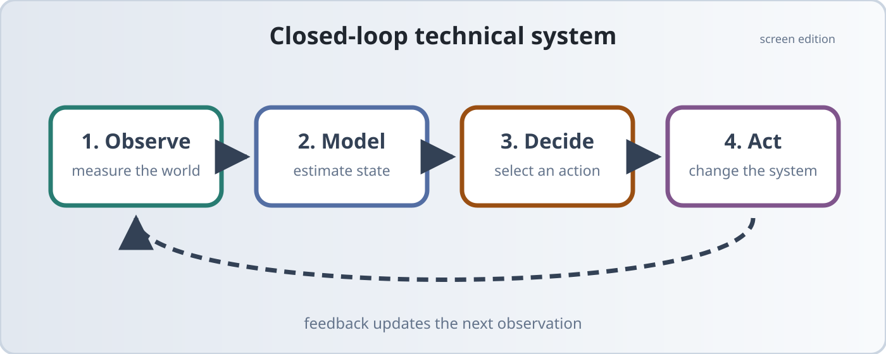
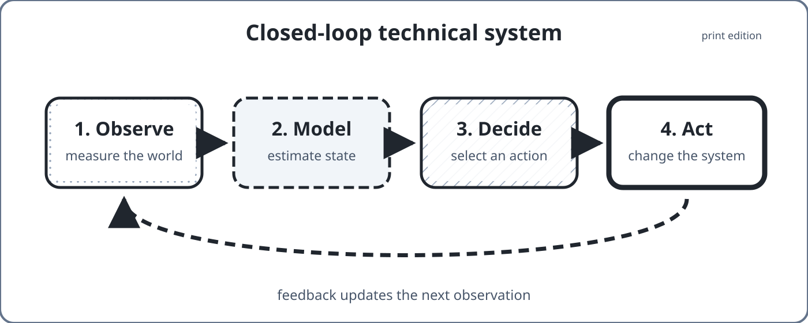
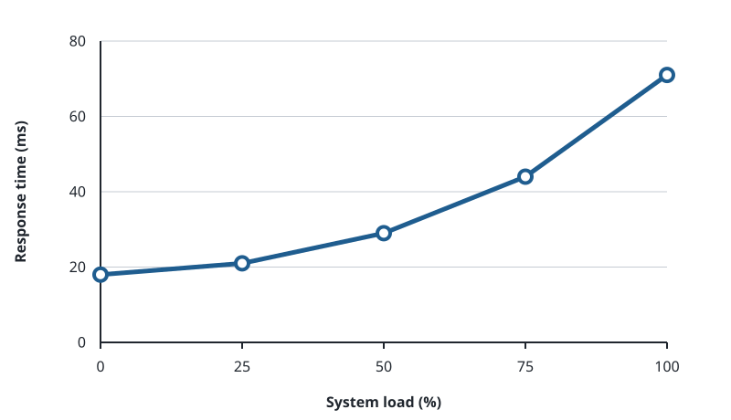
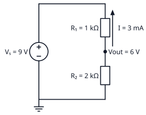
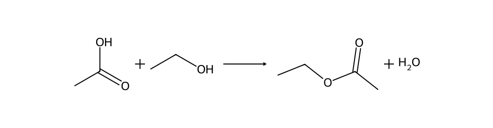

# Figures and technical diagrams {#sec-figures}

Figures use ordinary Quarto Markdown, stable identifiers, useful alternative
text, and captions that remain outside the artwork.

{#fig-signal-chain fig-alt="A signal flows from acquisition through filtering to analysis." width="80%"}

The reference in @fig-signal-chain is generated for HTML, EPUB, and Typst from
the same source. SVG is the default for diagrams and line art; photographs
should use an appropriately sized raster image.

## Output-specific artwork {#sec-figure-variants}

When screen and print genuinely require different artwork, use Quarto's
format-aware content rather than maintaining separate prose.

::: {.content-visible when-format="html"}
{#fig-system-map-screen fig-alt="A wide system map connects manuscript, validation, rendering, and publication." width="100%"}
:::

::: {.content-visible when-format="epub"}
{#fig-system-map-epub fig-alt="A compact system map connects manuscript, validation, rendering, and publication." width="100%"}
:::

::: {.content-visible when-format="typst"}
{#fig-system-map-print fig-alt="A portrait system map connects manuscript, validation, rendering, and publication." width="85%"}
:::

## Data-driven chart {#sec-chart-example}

{#fig-response-time fig-alt="A line chart shows response time increasing as system load rises." width="90%"}

The committed SVG in @fig-response-time is derived from
`figures/data/response-time.csv`. Authors may use any reproducible charting tool;
Alkahest requires only a portable publication asset and its editable source
data, not a project-specific generator inside the engine.

## Electrical circuit {#sec-circuit-example}

{#fig-voltage-divider fig-alt="A nine-volt source drives a one-kilohm and two-kilohm voltage divider whose junction is six volts." width="68%"}

The circuit in @fig-voltage-divider was created with Schemdraw and committed as
accessible SVG. Circuit generation belongs to the book that owns the design;
the publishing engine only needs to render the resulting asset consistently.

## Chemical diagram {#sec-chemistry-example}

{#fig-esterification fig-alt="A reaction diagram shows acetic acid plus ethanol producing ethyl acetate and water." width="85%"}

The reaction in @fig-esterification was created with RDKit. As with circuits,
authors retain the chemical source and generation method beside their book
rather than depending on a hard-coded Alkahest fixture generator.

## Placement policy {#sec-figure-placement}

Author figures close to their first reference. Typst may move a figure to a
nearby legal position to avoid a split caption or large gap. Stable identifiers
carry the relationship, so prose should not say “above,” “below,” or name a page
unless it is explicitly discussing one reviewed edition.

Do not encode a caption inside an image, repeat every visible label in the
alternative text, or create a print variant with materially different meaning.
